# 🚀 SK네트웍스 Family AI 캠프 24기 2차 프로젝트 

## 주제: 데이터분석 + 머신러닝 + 딥러닝을 활용한 가입 고객 이탈 예측 (Churn Prediction)


---

## 1. 2팀 소개 - 
- **팀명**: 천생연분 (churn 生緣分)
- **멤버**:
<table>
  <colgroup>
    <col style="width: 100%;">
    <col style="width: 100%;">
    <col style="width: 100%;">
    <col style="width: 100%;">
    <col style="width: 100%;">
  </colgroup>
  <tbody>
    <tr>
      <td style="text-align: center;"></td>
      <td style="text-align: center;"></td>
      <td style="text-align: center;"></td>
      <td style="text-align: center;"></td>
      <td style="text-align: center;"></td>
    </tr>
    <tr style="font-weight: bold;">
      <td style="text-align: center;">고아라</td>
      <td style="text-align: center;">권민제</td>
      <td style="text-align: center;">김규호</td>
      <td style="text-align: center;">김정현</td>
      <td style="text-align: center;">최현진</td>
    </tr>
    <tr>
      <td style="text-align: center;">
        <a href="https://github.com/Akoh-0909">
          
        </a>
      </td>
      <td style="text-align: center;">
        <a href="https://github.com/min3802">
          
        </a>
      </td>
      <td style="text-align: center;">
        <a href="https://github.com/kyu5KIm">
          
        </a>
      </td>
      <td style="text-align: center;">
        <a href="https://github.com/Jeich-16">
          
        </a>
      </td>
      <td style="text-align: center;">
        <a href="https://github.com/lifeisgoodlg">
          
        </a>
      </td>
    </tr>
  </tbody>
</table>

---

<br />


## 2. 프로젝트 개요

### 프로젝트 명
> 💘 OkCupid 데이팅앱 유저 데이터를 활용한 가입 고객 이탈 예측 (Churn Prediction)

### 프로젝트 소개
> OkCupid는 미국의 온라인 데이팅 플랫폼으로, 본 프로젝트에서 활용한 데이터셋은 **북캘리포니아 지역 한정의 과거 공개 데이터**임. OkCupid는 현재 서비스가 사실상 종료된 상태이며, 데이터 역시 행동 로그 없이 **프로필 정보만으로 구성**된 제한적인 데이터셋임.

이러한 한계에도 불구하고, 본 프로젝트는 해당 데이터를 활용해 **고객 이탈 예측 파이프라인을 직접 설계·구현**하고, ML/DL 모델의 성능을 비교 분석하는 것을 목표로 함. 개발된 파이프라인은 데이팅앱을 포함한 **구독형 서비스 전반의 이탈 예측에 적용 가능한 범용 프레임워크**로 확장될 수 있음.

### 프로젝트 필요성 (배경)

### 📊 데이팅앱 시장 10년 트렌드 (2015–2024)

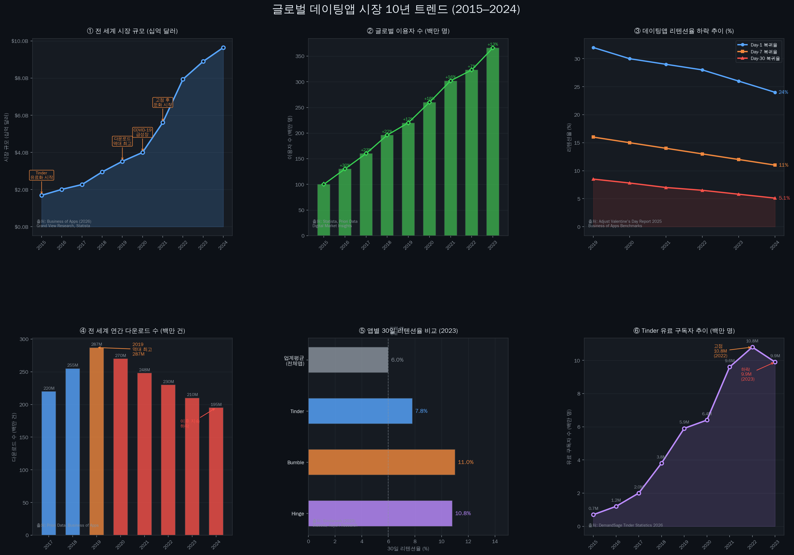

> **차트 읽는 법**
> - ① 시장 규모는 10년간 **5.7배 성장** ($1.69B → $9.65B) — 그러나 2021년 이후 성장세 뚜렷하게 둔화
> - ② 이용자 수는 꾸준히 증가했지만, ③ **리텐션율(복귀율)은 매년 하락** — 이용자는 늘어도 앱에 머무르지 않음
> - ④ 다운로드는 2019년 역대 최고(287M) 이후 **지속 감소** — 신규 유입이 줄고 있음
> - ⑤ 앱별 30일 리텐션: **Bumble 11%, Tinder 7.8%** — 업계 전체 평균(6%) 대비 여전히 낮은 수준
> - ⑥ Tinder 유료 구독자는 2022년 고점(10.8M) 이후 **첫 역성장** → 수익화 위기의 신호

| 출처 | 데이터 |
|---|---|
| [Business of Apps (2026)](https://www.businessofapps.com/data/dating-app-market/) | 전 세계 시장 규모 연도별 |
| [Statista / Priori Data](https://prioridata.com/data/tinder-statistics/) | 글로벌 이용자 수 |
| [Adjust Valentine's Day Report (2025)](https://www.adjust.com/blog/valentines-day-app-trends-2025/) | Day-1/7/30 리텐션율 연도별 추이 |
| [Similarweb (2023)](https://www.similarweb.com/blog/insights/hinge-bumble-dating-retention/) | 앱별 30일 리텐션 비교 |
| [DemandSage Tinder Statistics (2026)](https://www.demandsage.com/tinder-statistics/) | Tinder 유료 구독자 연도별 |

--- 

#### 📱 데이팅앱 시장의 성장

> 데이팅앱 시장은 전 세계적으로 빠르게 성장하고 있음.

| 지표 | 수치 | 출처 |
|---|---|---|
| 전 세계 데이팅앱 시장 규모 (2024) | **$81억** → 2027년 $87억 전망 | Statista (아시아경제, 2024.05.23 인용) |
| 국내 데이팅앱 시장 규모 (2024) | **$3,507만** → 2028년 $3,642만 전망 | Statista (아시아경제, 2024.05.23 인용) |
| 국내 데이팅앱 소비자 지출 (2023) | **약 1,614억원** ($1.2억) | data.ai, 2024 모바일 현황 보고서 (아시아경제, 2024.03.13 인용) |
| 국내 로맨스 스캠 피해액 (2023) | **55억 1,200만원** — 2020년 대비 15배 급증 | 아시아경제, 2024.05.23 |


> 📰 **뉴스 출처**  
> - 아시아경제, *커지는 데이팅 앱 시장…로맨스 스캠 주의보* (2024.05.23) — https://www.asiae.co.kr/article/2024052215114422592  
> - 아시아경제, *연애는 하고 싶지만, 돈 쓰긴 싫어…고민에 빠진 데이팅 앱* (2024.03.13) — https://www.asiae.co.kr/article/2024031310245014777

---

#### 📉 데이팅앱 산업의 위기 — 이탈과 수익화 실패

시장은 성장하지만, 동시에 심각한 구조적 문제를 안고 있음.

| 지표 | 수치 | 출처 |
|---|---|---|
| 글로벌 데이팅앱 주요 기업 시총 손실 | 매치그룹 **$400억**, 범블 **$180억** 증발 (2021년 이후 3년간) | 아시아경제, 2024.05.28 (FT 인용) |
| 미국 데이팅앱 지출 증가율 | 2022년 1월 **23.4%** → 2024년 1월 **6.2%** 로 급격 둔화 | 아시아경제, 2024.03.13 (data.ai 인용) |
| 성비 불균형 (영국 18~34세) | 남성 이용률 **47%** vs 여성 **25%** — 여성 이탈이 핵심 문제 | 아시아경제, 2024.05.28 (Mintel 인용) |

> 📰 **뉴스 출처**  
> - 아시아경제, *데이팅앱, 남자만 쓴다…"여성 이용자 유치 어려워"* (2024.05.28) — https://www.asiae.co.kr/article/2024052820301656222

---

#### 📚 Data Sources

| # | 매체 | 제목 | 성격 | 링크 |
|---|---|---|---|---|
| 1 | 아시아경제 (2024.05.23) | 커지는 데이팅 앱 시장…로맨스 스캠 주의보 | 📰 뉴스 — Statista 시장 규모·로맨스 스캠 통계 인용 | [바로가기](https://www.asiae.co.kr/article/2024052215114422592) |
| 2 | 아시아경제 (2024.03.13) | 연애는 하고 싶지만, 돈 쓰긴 싫어…고민에 빠진 데이팅 앱 | 📰 뉴스 — data.ai 미국 지출 증가율 둔화 통계 인용 | [바로가기](https://www.asiae.co.kr/article/2024031310245014777) |
| 3 | 아시아경제 (2024.05.28) | 데이팅앱, 남자만 쓴다…"여성 이용자 유치 어려워" | 📰 뉴스 — FT·Mintel 성비 불균형·시총 손실 인용 | [바로가기](https://www.asiae.co.kr/article/2024052820301656222) |
| 4 | openads (2024.02.05) | 자만추? 앱만추! 얼마를 써야 사랑을 찾을 수 있나요? | 📊 마케팅 인사이트 — 국내 데이팅앱 시장·소비자 지출 분석 (data.ai 인용) | [바로가기](https://www.openads.co.kr/content/contentDetail?contsId=12476) |
| 5 | 고대신문 (2024.06.03) | 틀린 만남은 없다, 문화로 자리 잡은 데이팅 앱 | 📰 대학신문 — 국내 2030 이용 현황·진정성 인식 설문 | [바로가기](https://www.kunews.ac.kr/news/articleView.html?idxno=42496) |


### 프로젝트 목표: 이진 분류 모델을 통해 이탈 고위험군 유저를 식별

1. OkCupid 프로필 데이터를 분석하여 이탈 관련 패턴을 탐색
2. ML(LR/DT/RF/XGB/LGBM/CatBoost) 및 DL모델을 학습·비교
3. 클래스 불균형 환경에서 **Recall 최대화**를 핵심 지표로 모델개선
4. 본 파이프라인을 다른 구독형 서비스에 적용 가능한 형태로 구축

### 데이터셋 한계 & 그럼에도 얻을 수 있는 인사이트

> ⚠️ **데이터 한계**  
> - 북캘리포니아 한정 해외 데이터 → 국내 서비스에 직접 적용 어려움  
> - 행동 데이터 없음 (접속 빈도, 클릭 등) → 이탈 원인과 직접 인과관계 약한 피처들  
> - `last_online` 기반 churn 정의의 모호함 → "짝을 찾아 떠난 이탈"과 "무관심으로 떠난 이탈"을 구분 불가 (기준: 180일 미접속)

| 인사이트 | 내용 | 실제 근거 |
|---|---|---|
| ⚖️ SMOTE의 함정 발견 | 잘못된 불균형 처리 방법 하나가 Recall을 0.01까지 끌어내림 — 직접 원인 분석 후 해결 | XGB Recall 0.018→0.411 (수치로 증명) |
| 🎯 Threshold는 도구, 성능이 아님 | 임계값 0.3 적용 시 Recall 0.927이지만, 이탈 예측 100명 중 91명이 오탐 — trade-off 직접 체감 | Precision 0.086로 확인 |
| 📉 데이터가 모델의 천장을 결정 | 모델 8개 모두 ROC-AUC 0.56~0.62 수렴 — 피처 정보량 자체가 한계임을 확인 | 전 모델 동일 구간 수렴 |
| 🔄 파이프라인 구조는 재사용 가능 | 전처리→학습→평가 흐름은 다른 서비스에 적용 가능한 구조로 설계됨 (피처 컬럼 재정의 필요) | 코드 모듈화 완료 |

---

### 데이터셋 기본 정보

<div>
  
</div>

- 출처: [OkCupid Profiles](https://github.com/rudeboybert/JSE_OkCupid)
- 규모: 약 59,946건 (거의 60,000명)
- 컬럼 개수: 31개
- 수집 지역: 샌프란시스코 (San Francisco)
- 수집 시기: 2012년 6월
- 데이터 타입: 구조화된 프로필 정보 + 자유 텍스트 (에세이)
  - int64 → 2개 (age, income)
  - float64 → 1개 (height)
  - object → 28개 (대부분 범주형/텍스트)

범주형 데이터 비중이 높은 프로필 설문 기반 데이터셋

### 데이터 선택
| 컬럼명       | 사용 여부 | 설명            | 데이터타입 |
|--------------|-----------|-----------------|------------|
| age          | ✅        | 사용자 나이     | int64      |
| status       | ✅        | 연애 상태       | object     |
| sex          | ✅        | 성별            | object     |
| orientation  | ✅        | 성적 지향       | object     |
| body_type    | ✅        | 체형            | object     |
| diet         | ✅        | 식단 성향       | object     |
| drinks       | ✅        | 음주 빈도       | object     |
| drugs        | ✅        | 약물 사용       | object     |
| education    | ✅        | 학력 상태       | object     |
| ethnicity    | ✅        | 인종            | object     |
| height       | ✅        | 키 (inch)       | float64    |
| income       | ❌        | 연소득 (USD)    | int64      |
| job          | ✅        | 직업            | object     |
| last_online  | ✅        | 마지막 접속     | object     |
| location     | ✅        | 거주 지역       | object     |
| offspring    | ❌        | 자녀 여부/계획  | object     |
| pets         | ✅        | 반려동물        | object     |
| religion     | ✅        | 종교 및 태도    | object     |
| sign         | ✅        | 별자리 및 태도  | object     |
| smokes       | ✅        | 흡연 여부       | object     |
| speaks       | ❌        | 사용 언어       | object     |
| essay0       | ✅        | 자기소개        | object     |
| essay1       | ✅        | 인생 방향       | object     |
| essay2       | ✅        | 잘하는 것       | object     |
| essay3       | ✅        | 첫인상          | object     |
| essay4       | ✅        | 취향            | object     |
| essay5       | ✅        | 필수 요소       | object     |
| essay6       | ✅        | 많이 생각하는 것| object     |
| essay7       | ✅        | 금요일 밤       | object     |
| essay8       | ✅        | 가장 사적인 고백| object     |
| essay9       | ✅        | 메시지 조건     | object     |


---

## 3. 기술 스택

```
Language     Python 
ML           scikit-learn, XGBoost, LightGBM, CatBoost
DL           PyTorch
Data         pandas, numpy
Viz          matplotlib, seaborn
Imbalance    imbalanced-learn (SMOTE)
Tuning       Optuna, GridSearch, RandomSearch, CrossValidation, K-Fold, early stopping, threshold
Save         joblib (ML), torch.save state_dict (DL)
Environment  Jupyter Notebook / VS Code
Version      Git / GitHub
```

---

## 4. WBS (Work Breakdown Structure)

<div>
  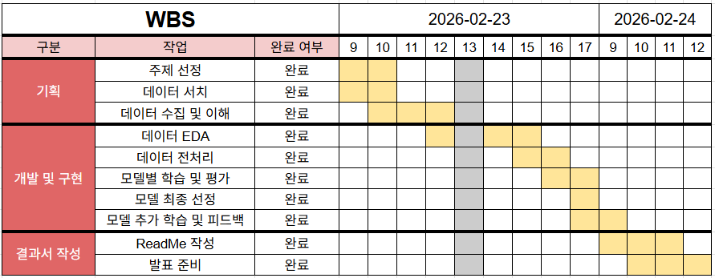
</div>


| 단계 | 작업 내용 | 담당 | 상태 |
|---|---|---|---|
| 1. 데이터 수집 | OkCupid 공개 데이터셋 로드 | All | ✅ |
| 2. EDA | 결측치·분포·상관관계 분석 | All | ✅ |
| 3. 전처리 | 인코딩, 스케일링, churn 생성 | All | ✅ |
| 4. ML 모델링 | LR/DT/RF/XGB/LGBM/CatBoost | All | ✅ |
| 5. DL 모델링 | ANN (PyTorch) | All | ✅ |
| 6. 성능 비교 | ML vs DL 비교표 & 시각화 | All | ✅ |
| 7. 수행 결과 | 결과 도출, 한계점 및 개선방안 | All | ✅ |
| 8. 한줄회고 | 회고(KPT) | All | ✅ |


---

## 5. 데이터 전처리 결과서 (EDA)

### 원본 데이터
> - 출처: OkCupid 공개 프로필 데이터셋
> - 크기: 59,946명 × 31개 컬럼 (원본)

### 타겟 변수 생성 (churn 정의)
```
last_online 컬럼 기준:
- 기준일(데이터 내 가장 최근 접속일: 2012-07-01)로부터 180일 이상 미접속 → 이탈(1)
- 180일 미만 → 잔류(0)
```


### 전처리 주요 작업

> 💡 범주형 object 타입 컬럼이 많아 **전처리 기준 확립이 핵심 과제**였음

**1. 결측치 처리**

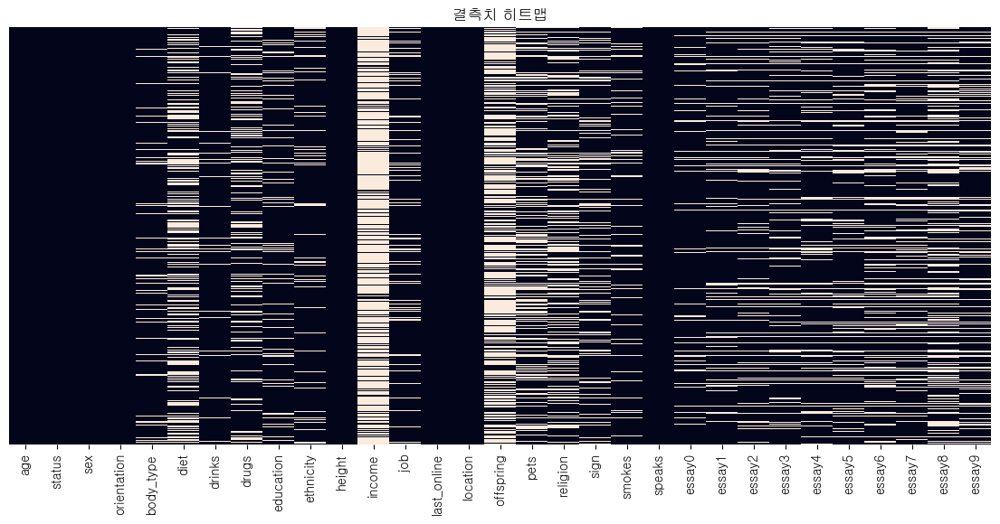

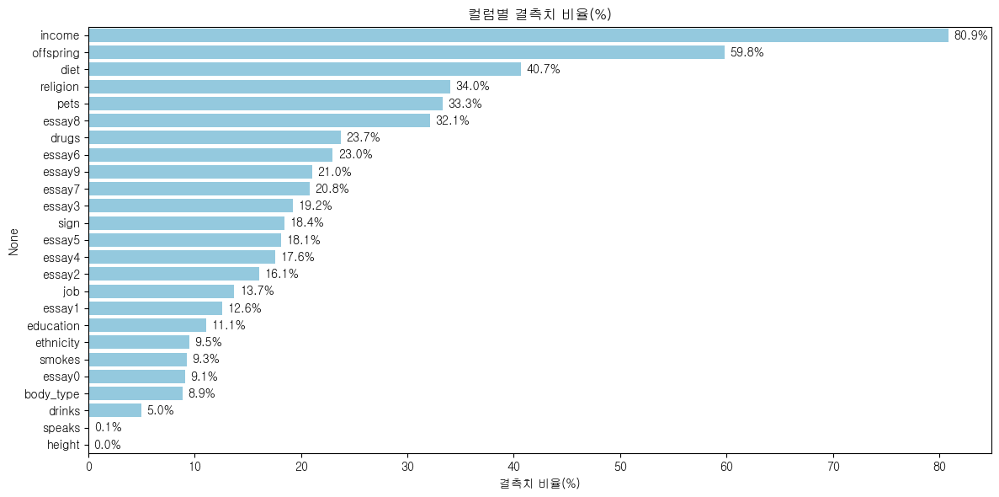

| 컬럼 | 처리 방법 |
|---|---|
| 수치형 (income 등) | 중앙값 대체 |
| 범주형 (religion, education 등) | 최빈값 대체 또는 'unknown' 처리 |
| 결측률 70% 초과 컬럼 | 제거 |

---

**2. 이상치 처리**


---

**3. 피처 인코딩 상세**

| 컬럼 | 인코딩 방식 | 변환 기준 |
|---|---|---|
| `age` | 연령대 그룹화 | 10대별 구간 분류 → `age_group` |
| `status` | Binary Encoding | single(1) / 나머지(0) → `status_encoding` |
| `orientation` | Label Encoding | straight(0) / gay·bisexual(1) |
| `body_type` | One-Hot Encoding | slim / average / fit / curvy → 4개 컬럼 |
| `education` | One-Hot Encoding | univ_grad / univ_ing / high_school / other → 4개 컬럼 |
| `religion` | One-Hot Encoding | religion(1) / no_religion(0) → 2개 컬럼 |
| `diet` | Binary Encoding | 채식·비건(1) / 비채식(0) → `diet_encoding` |
| `drinks` | One-Hot Encoding | no_drinks / moderate / heavy → 3개 컬럼 |
| `drugs` | Ordinal Encoding | never(2) / sometimes(1) / often(0) |
| `smokes` | One-Hot Encoding | no_smoke / smoke / sometime_smoke → 2개 컬럼 (drop_first=True) |
| `job` | Ordinal Encoding | 직군별 연봉 기준 0~5 분류 → `job_encoding` |
| `sign` | Binary Encoding | 별자리 믿음 여부 (1/0) → `sign_belief_encoding` |
| `ethnicity` | One-Hot Encoding | white / asian / black / hispanic / other / mixed → 6개 컬럼 |
| `pets` | Binary Encoding | dogs_encoding (강아지 선호 여부), cats_encoding (고양이 선호 여부) |
| `location` | One-Hot Encoding | sf / east_bay / south_bay / north_bay / outside → 5개 컬럼 |
| `last_online` | 파생 변수 → churn | 180일 이상 미접속 → 이탈(1) |

---

**4. 파생 변수 생성**

| 파생 변수 | 설명 | 생성 방식 |
|---|---|---|
| `age_group` | 연령대 그룹 | age를 10단위로 구간화 |
| `sign_belief_encoding` | 별자리 믿음 여부 | 믿음(1) / 안 믿음(0) |
| `job_encoding` | 직군 연봉 등급 | IT/과학, 비즈니스, 예술, 전문직 등 0~5 분류 |
| `status_encoding` | 연애 상태 | single(1) / 나머지(0) |
| `diet_encoding` | 식단 성향 | 채식·비건(1) / 비채식(0) |
| `dogs_encoding` | 강아지 선호 여부 | 선호(1) / 비선호(0) |
| `cats_encoding` | 고양이 선호 여부 | 선호(1) / 비선호(0) |
| `location_group` | 거주 지역 그룹 | sf / east_bay / south_bay / north_bay / outside |
| `churn` | 이탈 여부 (타겟) | last_online 기준 **180일** 이상 미접속 → 이탈(1) |

---

**5. 인코딩 & 스케일링**
- 이진 범주형: Label Encoding (sex, status 등)
- 다중 범주형: One-Hot Encoding (ethnicity, body_type 등)
- 수치형 범주형: Ordinal Encoding (education, income 등)
- ML 모델: StandardScaler (로지스틱 회귀 적용)
- DL 모델: StandardScaler (전체 피처)

---

**6. 클래스 불균형 처리**
```
원본 비율 — 잔류: 92% / 이탈: 8%

처리 방법:
  - ML (LR/DT/RF): SMOTE (train 데이터만) → 50:50
  - ML (XGB/LGBM/CatBoost): class_weight / scale_pos_weight
  - DL: pos_weight (BCEWithLogitsLoss)
```

---

**7. 최종 데이터셋 구조**
```
행: 59,934명  컬럼: 38개 (특성 37개 + churn 1개)
Train: 47,947명  Test: 11,987명 (stratify=y)
이탈 비율 — Train: 8.0%  Test: 8.0%
```

| 컬럼명 | 설명 | 데이터타입 |
|---|---|---|
| sex | 성별 | int8 |
| orientation | 성적지향 여부 | int8 |
| drugs | 약물 사용 (never=2 / sometimes=1 / often=0) | int8 |
| height | 키 (inch, 표준화) | float64 |
| sign_belief_encoding | 별자리 믿음 여부 | int64 |
| age_group | 연령대 그룹 (표준화) | float64 |
| education_high_school | 고등학교 이하 여부 | bool |
| education_other | 기타 학력 여부 | bool |
| education_univ_grad | 대학교 졸업 여부 | bool |
| education_univ_ing | 대학교 재학 여부 | bool |
| body_type_average | 보통 체형 여부 | bool |
| body_type_curvy | 통통한 체형 여부 | bool |
| body_type_fit | 건강/탄탄 체형 여부 | bool |
| body_type_slim | 마른 체형 여부 | bool |
| smokes_smoke | 흡연자 여부 | bool |
| smokes_sometime_smoke | 가끔 흡연 여부 | bool |
| drinks_heavy | 과음 여부 | bool |
| drinks_moderate | 적당한 음주 여부 | bool |
| drinks_no_drinks | 비음주 여부 | bool |
| religion_no_religion | 무교 여부 | bool |
| religion_religion | 종교 여부 | bool |
| job_encoding | 직군 연봉 등급 0~5 | int64 |
| status_encoding | 연애 상태 (single=1) | int64 |
| diet_encoding | 식단 (채식=1 / 비채식=0) | int64 |
| ethnicity_asian | 아시아계 여부 | bool |
| ethnicity_black | 흑인 여부 | bool |
| ethnicity_hispanic / latin | 히스패닉/라틴계 여부 | bool |
| ethnicity_mixed | 혼혈 여부 | bool |
| ethnicity_other | 기타 인종 여부 | bool |
| ethnicity_white | 백인 여부 | bool |
| dogs_encoding | 강아지 선호 여부 | int64 |
| cats_encoding | 고양이 선호 여부 | int64 |
| location_group_east_bay | East Bay 거주 여부 | bool |
| location_group_north_bay | North Bay 거주 여부 | bool |
| location_group_outside | 외곽 거주 여부 | bool |
| location_group_sf | SF 거주 여부 | bool |
| location_group_south_bay | South Bay 거주 여부 | bool |
| churn | 고객 이탈 (타겟) | int64 |

---


## 6. 인공지능 학습 결과서

### 평가 지표 선정 이유
> 이탈 고객을 **놓치지 않는 것**이 핵심 → **Recall(재현율)**최우선
> ROC-AUC로 전체 판별력, F1으로 균형 성능 보조 확인

### 6-1. 머신러닝 (ML) 모델

#### 초기 학습 결과 (v1 — SMOTE 적용, XGB/LGBM/CatBoost 문제 있음)

| 모델 | Recall | ROC-AUC | F1 | Precision |
|---|---|---|---|---|
| Decision Tree | 0.492 | 0.560 | 0.158 | 0.094 |
| Random Forest | 0.457 | 0.587 | 0.164 | 0.100 |
| Logistic Regression | 0.301 | 0.561 | 0.153 | 0.102 |
| **XGBoost** | **0.018** | 0.588 | 0.033 | 0.185 |
| **LightGBM** | **0.015** | 0.593 | 0.027 | 0.189 |
| **CatBoost** | **0.011** | 0.598 | 0.020 | 0.147 |

> ⚠️ XGBoost/LightGBM/CatBoost: SMOTE 데이터를 eval_set으로 사용하여 early stopping이 잘못 작동 → Recall 거의 0

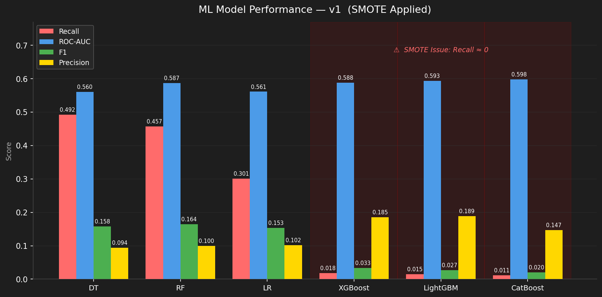

#### 문제 해결 — 성능 향상을 위한 노력 (v2)

**원인 분석:** SMOTE 처리된 데이터로 early_stopping을 수행하면 원본 불균형 패턴을 학습하지 못함

**해결 방법:** `class_weight / scale_pos_weight / auto_class_weights`로 교체 + 원본 데이터로 학습

```python
# XGBoost: scale_pos_weight (잔류수 / 이탈수)
XGBClassifier(scale_pos_weight=11.55)

# LightGBM: class_weight='balanced'
LGBMClassifier(class_weight='balanced')

# CatBoost: auto_class_weights='Balanced'
CatBoostClassifier(auto_class_weights='Balanced')
```

#### 개선 후 결과 (v2)

| 모델 | Recall | ROC-AUC | F1 | Precision |
|---|---|---|---|---|
| Decision Tree | 0.492 | 0.560 | 0.158 | 0.094 |
| **CatBoost** ⭐ | **0.472** | **0.611** | **0.189** | **0.118** |
| Random Forest | 0.457 | 0.587 | 0.164 | 0.100 |
| LightGBM | 0.423 | 0.603 | 0.182 | 0.116 |
| XGBoost | 0.411 | 0.594 | 0.177 | 0.113 |
| Logistic Regression | 0.301 | 0.561 | 0.153 | 0.102 |

> ✅ XGBoost Recall: 0.018 → 0.411 (+0.393)  
> ✅ LightGBM Recall: 0.015 → 0.423 (+0.408)  
> ✅ CatBoost Recall: 0.011 → 0.472 (+0.461) — ML 최고 성능  

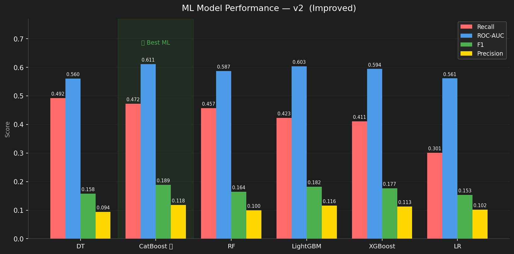

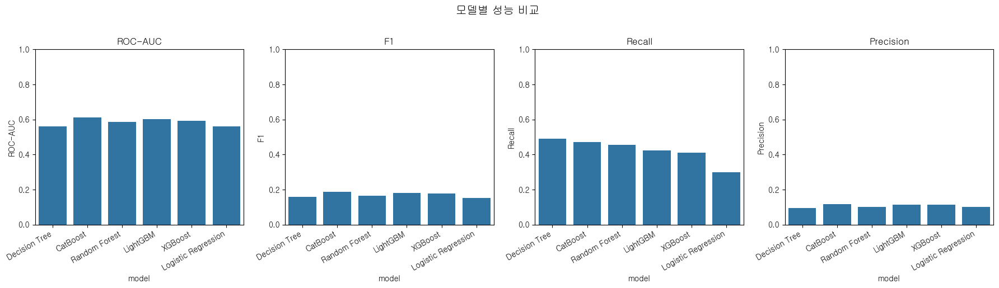

---

### 6-2. 딥러닝 (DL) 모델 — PyTorch

#### 모델 구조

**ANN Basic**
```
Input(37) → Linear(64) → ReLU → Linear(32) → ReLU → Linear(1)
Loss: BCEWithLogitsLoss(pos_weight=11.55)
Optimizer: Adam(lr=0.001)
```

**ANN Advanced**
```
Input(37) → Linear(128) → BatchNorm → ReLU → Dropout(0.3)
         → Linear(64)  → BatchNorm → ReLU → Dropout(0.3)
         → Linear(32)  → ReLU
         → Linear(1)
Loss: BCEWithLogitsLoss(pos_weight=11.55)
Optimizer: AdamW(lr=0.001, weight_decay=0.01)
Scheduler: ReduceLROnPlateau(patience=5, factor=0.5)
EarlyStopping: patience=20
```

#### 성능 향상을 위한 노력

| 시도 | 내용 | 효과 |
|---|---|---|
| pos_weight 설정 | 불균형 처리 (잔류수/이탈수 = 11.55) | Recall 향상 |
| BatchNorm 추가 | 학습 안정화 | Loss 감소 안정화 |
| Dropout(0.3) | 과적합 방지 | Val Loss 개선 |
| AdamW | Weight Decay 적용 | 일반화 성능 향상 |
| ReduceLROnPlateau | 동적 LR 감소 | 수렴 개선 |
| Threshold 조정 | 0.5 → 0.3 | Recall 0.544 → 0.927 |
| patience 조정 (v2) | 5→15 (Basic), 7→20 (Advanced) | 충분한 학습 보장 |

> 💡 **patience를 늘려도 Epoch 17~23에서 조기 종료** → 데이터 자체의 한계로 추가 튜닝 효과 없음

#### DL 최종 결과 (v2)

| 모델 | Recall | ROC-AUC | F1 | Precision |
|---|---|---|---|---|
| ANN Advanced (thr=0.3) | **0.927** | 0.621 | 0.157 | **0.086** |
| ANN Advanced (thr=0.5) | 0.544 | **0.621** | **0.192** | 0.117 |
| ANN Basic (thr=0.5) | 0.483 | 0.588 | 0.170 | 0.103 |

> 💡 **patience를 늘려도 ANN Basic Epoch 17, ANN Advanced Epoch 23에서 조기 종료** → 데이터 자체의 한계로 추가 튜닝 효과 없음

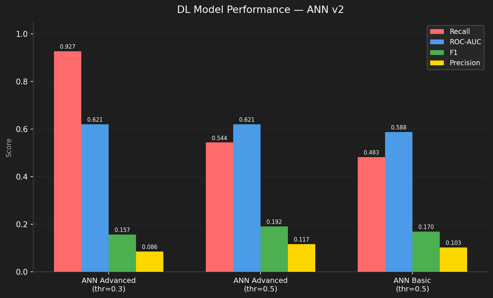

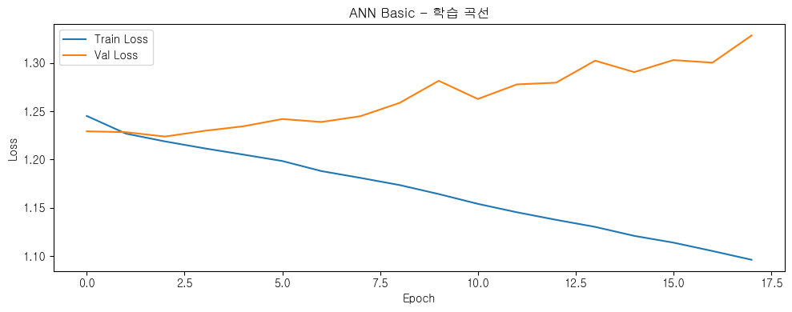


---

### 6-3. ML vs DL 최종 비교

| 순위 | 모델 | Recall | ROC-AUC | F1 |
|---|---|---|---|---|
| 🥇 | ANN Advanced (thr=0.3) | **0.927** | 0.621 | 0.157 |
| 🥈 | ANN Advanced (thr=0.5) | 0.544 | **0.621** | **0.192** |
| 🥉 | DT (ML) | 0.492 | 0.560 | 0.158 |
| 4 | ANN Basic | 0.483 | 0.588 | 0.170 |
| 5 | CatBoost (ML) | 0.472 | 0.611 | 0.189 |

> 💡 **Recall 기준**: DL(ANN) > ML — DL이 이탈 고객을 더 잘 잡아냄  
> 💡 **ROC-AUC 기준**: DL(0.621) > ML CatBoost(0.611) — DL의 전반적 판별력 우수  
> 💡 **F1 균형**: Threshold 0.5 기준 ANN Advanced(0.192) ≈ CatBoost(0.189) — 동등  
> 💡 **데이터 한계**: 프로필 기반 데이터 특성상 ROC-AUC 0.65 이상 향상 어려움  

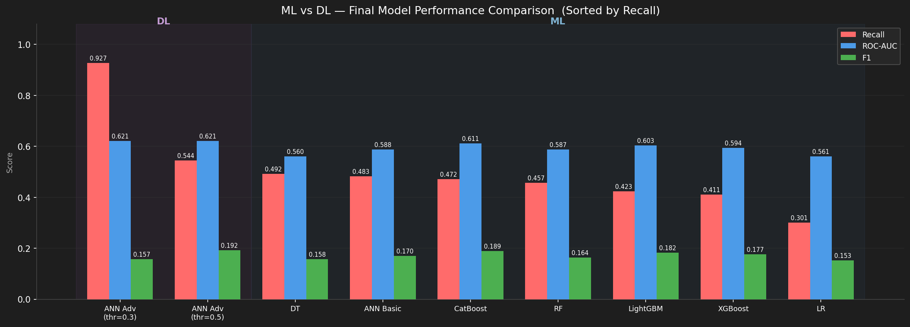

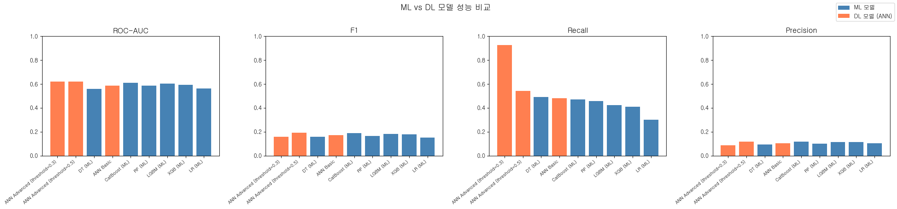

### 6-4. 최종 성능 요약

| 모델 | Recall | ROC-AUC | F1 | 비고 |
|---|---|---|---|---|
| ANN Advanced (thr=0.3) | **0.927** | 0.621 | 0.157 | Recall 최대, Precision 희생 |
| ANN Advanced (thr=0.5) | 0.544 | **0.621** | **0.192** | 균형 최적 |
| CatBoost | 0.472 | 0.611 | 0.189 | ML 최고, 해석 용이 |
| LightGBM | 0.423 | 0.603 | 0.182 | |
| XGBoost | 0.411 | 0.594 | 0.177 | |
| Random Forest | 0.457 | 0.587 | 0.164 | |
| ANN Basic | 0.483 | 0.588 | 0.170 | |
| Logistic Regression | 0.301 | 0.561 | 0.153 | |

> ✔️ **목표 달성 여부 최종 평가**
> - 이탈 패턴 탐색: ✅ 완료
> - ML/DL 비교 학습: ✅ 완료
> - Recall 최대화: ✅ 수치 달성 — 단, ROC-AUC 0.621은 데이터 한계로 인한 상한선
> - 범용 파이프라인: ✅ 구조 설계 완료 — 다른 서비스 적용 시 피처 컬럼 재정의 필요

---

## 7. 수행 결과 


### 테스트 데이터 넣어서 결과 도출

> 테스트 데이터: **11,987명** (이탈 955명 / 잔류 11,032명, 비율 8:92 유지)

#### ML 모델 테스트 결과

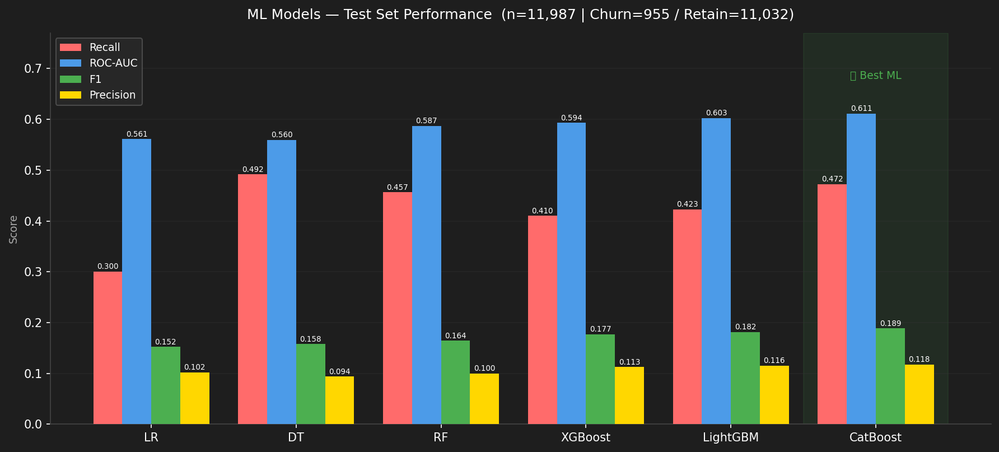

#### DL 모델 테스트 결과 & Threshold 비교

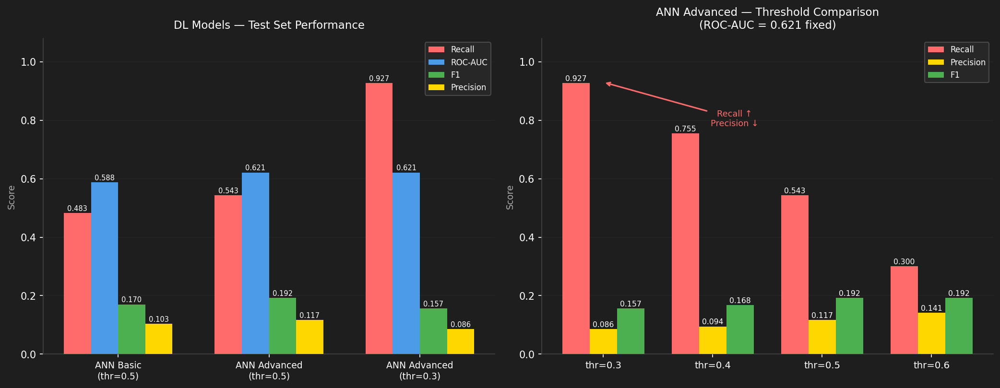

#### ML vs DL 최종 비교

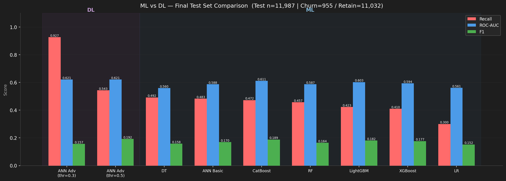


### 🔍 한계점

* **'좋은 이탈'의 미구분**
    * 서비스 목적(매칭 성공 등)을 달성하여 떠나는 **'좋은 이탈'**이 일반 이탈과 혼재되어 있음.
    * 현재 학습 데이터 내에서 좋은 이탈과 나쁜 이탈의 유형이 구분되지 않아 모델의 전체적인 **변별력 저하** 발생.

---

### 개선방안

* **비지도 학습 기반의 이탈 동기 군집화**
    * 향후 비지도 학습을 도입하여 단순히 이탈 여부(0, 1)만 맞추는 것을 넘어, **이탈의 성격(동기)에 따른 군집 분석** 수행.
* **분석의 다각화 및 범용성 확보**
    * 이탈 패턴의 정교한 해석을 통해 데이팅 앱뿐만 아니라 채용, 교육 등 **목적 달성형 구독 서비스** 전반에 적용 가능한 예측 프레임워크 구축 가능.
    * 서비스 유형에 따른 복합적인 이탈 패턴을 분석하는 **범용적 모델**로의 확장성 기대.


---

## 8. 한 줄 회고

<table>
  <colgroup>
    <col style="width: 10%; text-align: center;">
    <col style="width: 85%;">
  </colgroup>
  <thead>
    <tr>
      <th style="text-align: center;">이름</th>
      <th style="text-align: center;">회고</th>
    </tr>
  </thead>
  <tbody>
    <tr>
      <td style="text-align: center;"><strong>고아라</strong></td>
      <td>
  <strong>[Keep]</strong> README 파이프라인 및 문서화 작업, 깃허브 초기세팅 및 컨트리뷰트 등에서 팀에 기여할 수 있었다.<br>
  <strong>[Problem]</strong> ML/DL 모델의 전체적인 흐름과 구조에 대한 학습이 더 필요하다고 느꼈다.<br>
  <strong>[Try]</strong> SMOTE 적용 후 XGBoost/LightGBM의 Recall이 0에 가까워지는 문제를 직접 발견하고 원인을 분석해 해결하면서, 데이터와 모델의 특성을 함께 이해해야 한다는 것을 배웠다. ML과 DL 전반적인 파이프라인에 대한 좀 더 깊은 이해가 필요할 것 같다. 
</td>
    </tr>
    <tr>
      <td style="text-align: center;"><strong>권민제</strong></td>
      <td>이번 프로젝트를 통해 모델의 성능 향상을 위한 노력을 기울인 결과, 하이퍼 파라미터 튜닝만큼이나 목적에 부합하는 데이터 전처리가 모델의 예측력에 결정적인 영향을 미친다는 점을 깊이 체감했습니다.  <br>이러한 성찰을 바탕으로 향후에는 비지도 학습을 활용하여 유저의 이탈 동기를 정교하게 라벨링하고 세분화함으로써, 현재의 이진 분류 모델이 가진 한계를 극복하고 모델의 변별력을 한층 더 고도화하는 시도를 이어가고자 합니다.</td>
    </tr>
    <tr>
      <td style="text-align: center;"><strong>김규호</strong></td>
      <td>keep: 데이터의 전처리 과정의 모든 사람의 의견을 듣고 모두가 납득할 방법으로 전처리 시행, 모든 과정에 대해 궁금증을 가지고 접근 <br>
      problem: 행동 데이터의 전처리 과정에 대해 의견 취합<br>
      try: 의견 충돌이 났을 때 두 전처리 데이터를 모두 사용 해보기</td>
    </tr>
    <tr>
      <td style="text-align: center;"><strong>김정현</strong></td>
      <td>이번 프로젝트 진행을 위해 살펴본 해당 데이터셋은 대부분 문자열 값을 갖는 컬럼들이었습니다. 시간이 오래 걸릴 것으로 예상되어 팀원들과 하나씩 의견을 나누며 EDA/전처리 과정을 수행했습니다. <br>다만 컬럼 하나하나마다 범주화를 어떻게 할지 정하는 게 쉽지 않아 전처리 작업이 어려웠고, 기대만큼 모델들의 성능이 나오지 않아 걱정이 컸습니다. 전처리에 대해서는, 처음부터 복잡한 전처리에 매달리기보다 아주 단순한 모델을 먼저 만들고 단계적으로 전처리를 고도화하는 방식을 고려해 보겠습니다. 또한, 성능 향상에 도움이 되는 방법들을 적용해 보고 성능 변화를 살펴보도록 하겠습니다.</td>
    </tr>
    <tr>
      <td style="text-align: center;"><strong>최현진</strong></td>
      <td></td>
    </tr>
  </tbody>
</table>


---

## 📁 프로젝트 폴더 구조
---
```

📁 SKN24-2ND-2Team/
├── 📁 data/
│   ├── raw/              ← Kaggle 원본 데이터 CSV (gitignore 처리)
│   └── processed/        ← 전처리 완료데이터 CSV (gitignore 처리)
│
├── 📁 docs/
│   ├── 기획서.md          ← 프로젝트 기획 문서
│   ├── EDA_결과.md        ← 데이터 분석 정리
│   └── 회의록/            ← 팀 회의 기록
│
├── 📁 models/
│   ├── saved/            ← 학습된 모델 파일 (gitignore 처리)
│   └── results/          ← 모델별 성능 비교 결과 CSV나 이미지
│
├── 📁 notebooks/
│   ├── 01_EDA.ipynb
│   ├── 02_preprocessing.ipynb
│   ├── 03_ML_models.ipynb
│   └── 04_DL_models.ipynb
│
├── 📁 src/
│   ├── preprocess.py     ← 전처리 함수 모듈
│   ├── train.py          ← 학습 실행 스크립트
│   ├── evaluate.py       ← 평가 지표 함수
│   └── predict.py        ← 예측 실행 스크립트
│
├── .gitignore
├── README.md
└── requirements.txt


```


