# 🚀 SK네트웍스 Family AI 캠프 24기 2차 프로젝트 

## 주제: 💘 OkCupid 데이팅앱 유저 데이터를 활용한 가입 고객 이탈 예측 (Churn Prediction)


---

## 1. 2팀 소개 
- **팀명**: 천생연분 (churn 生緣分)
- **팀원**:
 <table>
  <colgroup>
    <col style="width: 100%;">
    <col style="width: 100%;">
    <col style="width: 100%;">
    <col style="width: 100%;">
    <col style="width: 100%;">
  </colgroup>
  <tbody>
    <tr>
      <td style="text-align: center;"></td>
      <td style="text-align: center;">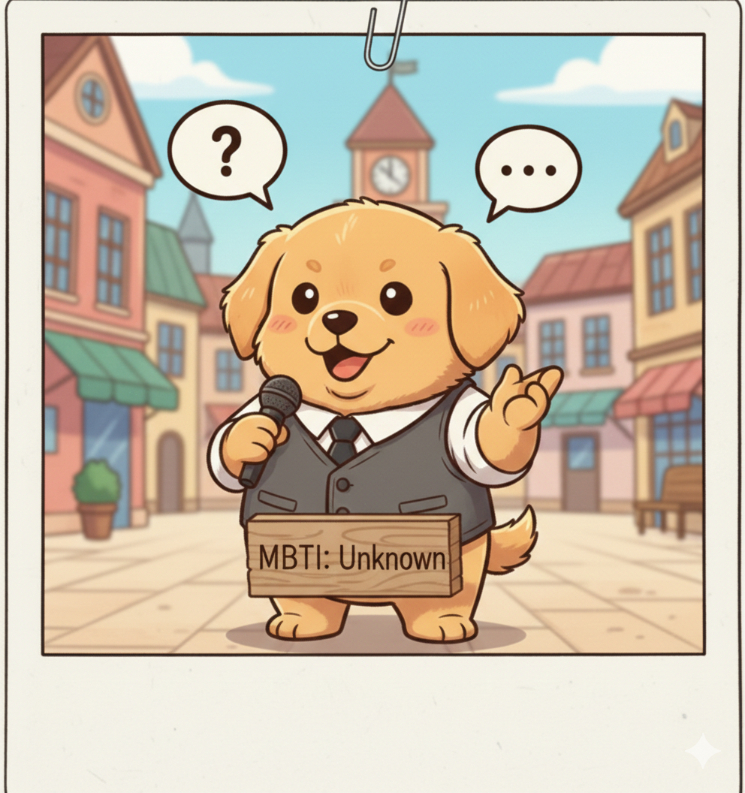</td>
      <td style="text-align: center;">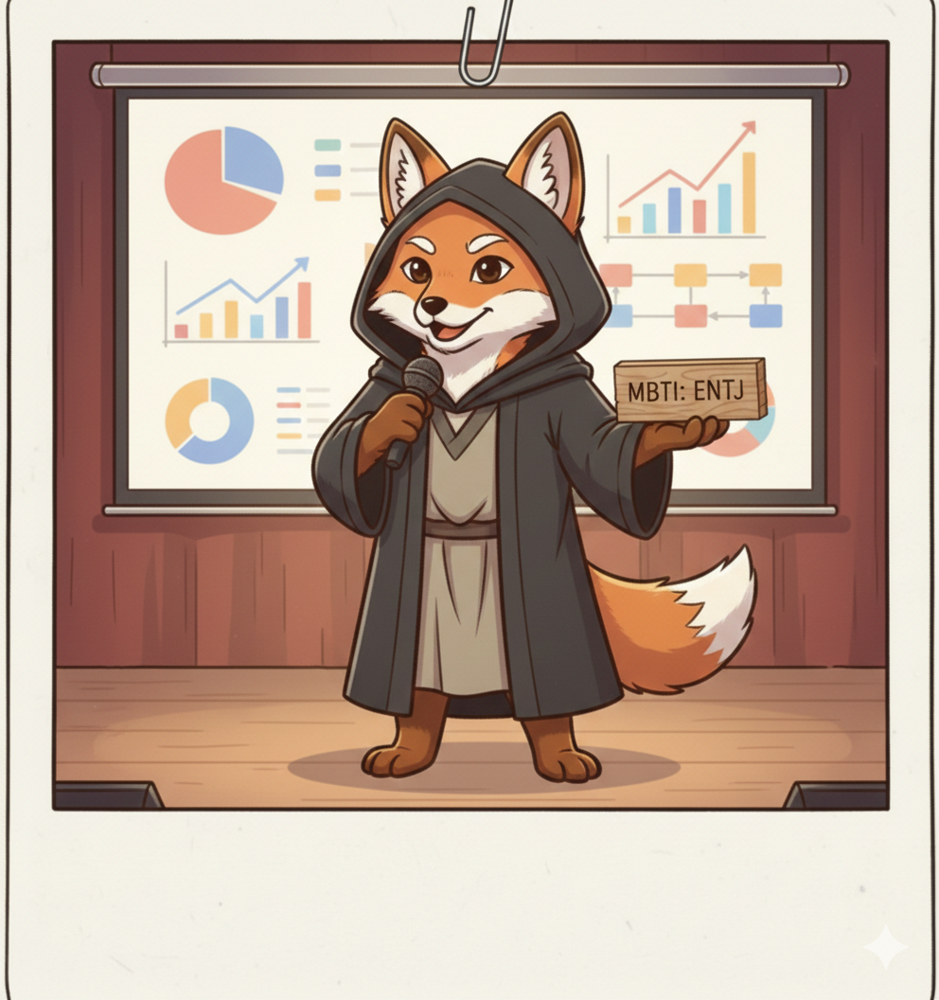</td>
      <td style="text-align: center;"></td>
      <td style="text-align: center;"></td>
    </tr>
    <tr style="font-weight: bold;">
      <td style="text-align: center;">고아라</td>
      <td style="text-align: center;">권민제</td>
      <td style="text-align: center;">김규호</td>
      <td style="text-align: center;">김정현</td>
      <td style="text-align: center;">최현진</td>
    </tr>
    <tr>
      <td style="text-align: center;">
        <a href="https://github.com/Akoh-0909">
          
        </a>
      </td>
      <td style="text-align: center;">
        <a href="https://github.com/min3802">
          
        </a>
      </td>
      <td style="text-align: center;">
        <a href="https://github.com/kyu5KIm">
          
        </a>
      </td>
      <td style="text-align: center;">
        <a href="https://github.com/Jeich-16">
          
        </a>
      </td>
      <td style="text-align: center;">
        <a href="https://github.com/lifeisgoodlg">
          
        </a>
      </td>
    </tr>
  </tbody>
</table>

---


## 2. 프로젝트 개요

### 프로젝트 명: 
> 💘 OkCupid 데이팅앱 유저 데이터를 활용한 가입 고객 이탈 예측 (Churn Prediction)

### 프로젝트 소개
> OkCupid는 미국의 온라인 데이팅 플랫폼으로, 본 프로젝트에서 활용한 데이터셋은 **북캘리포니아 지역 한정의 과거 공개 데이터**임. OkCupid는 현재 서비스가 사실상 종료된 상태이며, 데이터 역시 행동 로그 없이 **프로필 정보만으로 구성**된 제한적인 데이터셋임.

이러한 한계에도 불구하고, 본 프로젝트는 해당 데이터를 활용해 **고객 이탈 예측 파이프라인을 직접 설계·구현**하고, ML 모델의 성능을 비교 분석하는 것을 목표로 함. 개발된 파이프라인은 데이팅앱을 포함한 **구독형 서비스 전반의 이탈 예측에 적용 가능한 범용 프레임워크**로 확장될 수 있음.

### 프로젝트 필요성 (배경)

### 📊 데이팅앱 시장 10년 트렌드 (2015–2024)


> **차트 읽는 법**
> - ① 시장 규모는 10년간 **5.7배 성장** ($1.69B → $9.65B) — 그러나 2021년 이후 성장세 뚜렷하게 둔화
> - ② 이용자 수는 꾸준히 증가했지만, ③ **리텐션율(복귀율)은 매년 하락** — 이용자는 늘어도 앱에 머무르지 않음
> - ④ 다운로드는 2019년 역대 최고(287M) 이후 **지속 감소** — 신규 유입이 줄고 있음
> - ⑤ 앱별 30일 리텐션: **Bumble 11%, Tinder 7.8%** — 업계 전체 평균(6%) 대비 여전히 높은 수준
> - ⑥ Tinder 유료 구독자는 2022년 고점(10.8M) 이후 **첫 역성장** → 수익화 위기의 신호

| 출처 | 데이터 |
|---|---|
| [Business of Apps (2026)](https://www.businessofapps.com/data/dating-app-market/) | 전 세계 시장 규모 연도별 |
| [Statista / Priori Data](https://prioridata.com/data/tinder-statistics/) | 글로벌 이용자 수 |
| [Adjust Valentine's Day Report (2025)](https://www.adjust.com/blog/valentines-day-app-trends-2025/) | Day-1/7/30 리텐션율 연도별 추이 |
| [Similarweb (2023)](https://www.similarweb.com/blog/insights/hinge-bumble-dating-retention/) | 앱별 30일 리텐션 비교 |
| [DemandSage Tinder Statistics (2026)](https://www.demandsage.com/tinder-statistics/) | Tinder 유료 구독자 연도별 |

--- 

#### 📱 데이팅앱 시장의 성장

> 데이팅앱 시장은 전 세계적으로 빠르게 성장하고 있음.

| 지표 | 수치 | 출처 |
|---|---|---|
| 전 세계 데이팅앱 시장 규모 (2024) | **$81억** → 2027년 $87억 전망 | Statista (아시아경제, 2024.05.23 인용) |
| 국내 데이팅앱 시장 규모 (2024) | **$3,507만** → 2028년 $3,642만 전망 | Statista (아시아경제, 2024.05.23 인용) |
| 국내 데이팅앱 소비자 지출 (2023) | **약 1,614억원** ($1.2억) | data.ai, 2024 모바일 현황 보고서 (아시아경제, 2024.03.13 인용) |
| 국내 로맨스 스캠 피해액 (2023) | **55억 1,200만원** — 2020년 대비 15배 급증 | 아시아경제, 2024.05.23 |


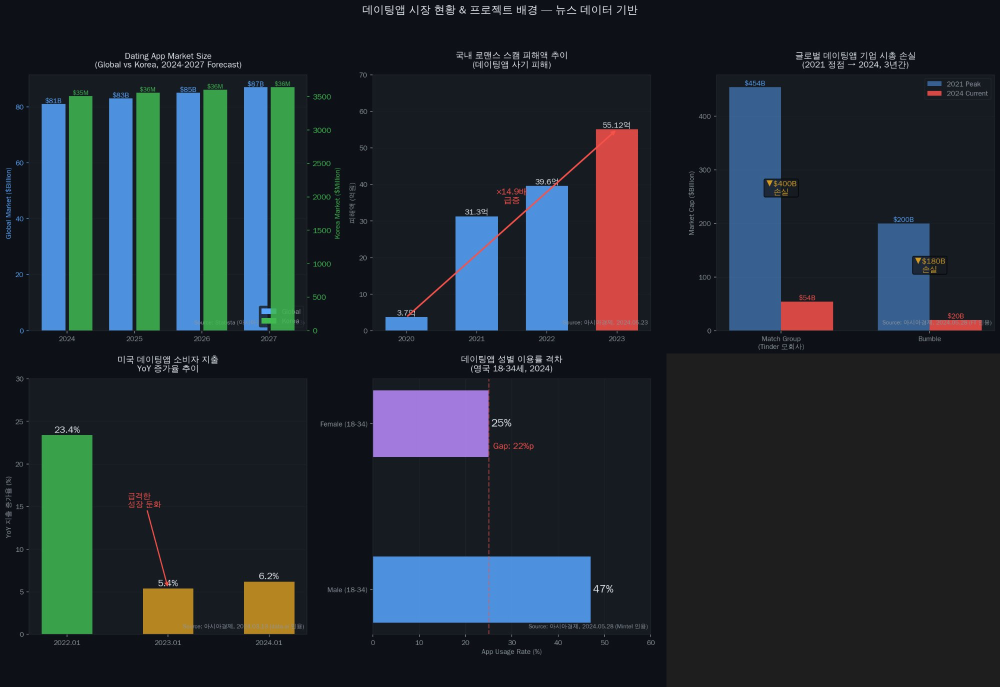


> 📰 **뉴스 출처**  
> - 아시아경제, *커지는 데이팅 앱 시장…로맨스 스캠 주의보* (2024.05.23) — https://www.asiae.co.kr/article/2024052215114422592  
> - 아시아경제, *연애는 하고 싶지만, 돈 쓰긴 싫어…고민에 빠진 데이팅 앱* (2024.03.13) — https://www.asiae.co.kr/article/2024031310245014777

---

#### 📉 데이팅앱 산업의 위기 — 이탈과 수익화 실패

시장은 성장하지만, 동시에 심각한 구조적 문제를 안고 있음.

| 지표 | 수치 | 출처 |
|---|---|---|
| 글로벌 데이팅앱 주요 기업 시총 손실 | 매치그룹 **$400억**, 범블 **$180억** 증발 (2021년 이후 3년간) | 아시아경제, 2024.05.28 (FT 인용) |
| 미국 데이팅앱 지출 증가율 | 2022년 1월 **23.4%** → 2024년 1월 **6.2%** 로 급격 둔화 | 아시아경제, 2024.03.13 (data.ai 인용) |
| 성비 불균형 (영국 18~34세) | 남성 이용률 **47%** vs 여성 **25%** — 여성 이탈이 핵심 문제 | 아시아경제, 2024.05.28 (Mintel 인용) |

> 📰 **뉴스 출처**  
> - 아시아경제, *데이팅앱, 남자만 쓴다…"여성 이용자 유치 어려워"* (2024.05.28) — https://www.asiae.co.kr/article/2024052820301656222


---

#### 📚 참고 문헌

| # | 매체 | 제목 | 성격 | 링크 |
|---|---|---|---|---|
| 1 | 아시아경제 (2024.05.23) | 커지는 데이팅 앱 시장…로맨스 스캠 주의보 | 📰 뉴스 — Statista 시장 규모·로맨스 스캠 통계 인용 | [바로가기](https://www.asiae.co.kr/article/2024052215114422592) |
| 2 | 아시아경제 (2024.03.13) | 연애는 하고 싶지만, 돈 쓰긴 싫어…고민에 빠진 데이팅 앱 | 📰 뉴스 — data.ai 미국 지출 증가율 둔화 통계 인용 | [바로가기](https://www.asiae.co.kr/article/2024031310245014777) |
| 3 | 아시아경제 (2024.05.28) | 데이팅앱, 남자만 쓴다…"여성 이용자 유치 어려워" | 📰 뉴스 — FT·Mintel 성비 불균형·시총 손실 인용 | [바로가기](https://www.asiae.co.kr/article/2024052820301656222) |
| 4 | openads (2024.02.05) | 자만추? 앱만추! 얼마를 써야 사랑을 찾을 수 있나요? | 📊 마케팅 인사이트 — 국내 데이팅앱 시장·소비자 지출 분석 (data.ai 인용) | [바로가기](https://www.openads.co.kr/content/contentDetail?contsId=12476) |
| 5 | 고대신문 (2024.06.03) | 틀린 만남은 없다, 문화로 자리 잡은 데이팅 앱 | 📰 대학신문 — 국내 2030 이용 현황·진정성 인식 설문 | [바로가기](https://www.kunews.ac.kr/news/articleView.html?idxno=42496) |


### **프로젝트 목표**: 이진 분류 모델을 통해 이탈 고위험군 유저를 식별

1. OkCupid 프로필 데이터를 분석하여 이탈 관련 패턴을 탐색.
2. ML(LR/RF/XGB/LGBM/CatBoost)을 학습·비교.
3. 클래스 불균형 환경에서 **Recall 최대화**를 핵심 지표로 모델 개선.
4. 본 파이프라인을 다른 구독형 서비스에 적용 가능한 형태로 구축.

### 데이터셋 기본 정보

<div>
  
</div>

- 출처: - [OkCupid Profiles](https://github.com/rudeboybert/JSE_OkCupid)
- 규모: 약 59,946건 (거의 60,000명)
- 컬럼 개수: 31개
- 데이터 타입: 
  - int64 → 2개 (age, income)
  - float64 → 1개 (height)
  - object → 28개 (대부분 범주형/텍스트)

범주형 데이터 비중이 높은 프로필 설문 기반 데이터셋

### 데이터 선택
| 컬럼명       | 사용 여부 | 설명            | 데이터타입 |
|--------------|-----------|-----------------|------------|
| age          | ✅        | 사용자 나이     | int64      |
| status       | ✅        | 연애 상태       | object     |
| sex          | ✅        | 성별            | object     |
| orientation  | ✅        | 성적 지향       | object     |
| body_type    | ✅        | 체형            | object     |
| diet         | ✅        | 식단 성향       | object     |
| drinks       | ✅        | 음주 빈도       | object     |
| drugs        | ✅        | 약물 사용       | object     |
| education    | ✅        | 학력 상태       | object     |
| ethnicity    | ❌        | 인종            | object     |
| height       | ✅        | 키 (inch)       | float64    |
| income       | ❌        | 연소득 (USD)    | int64      |
| job          | ✅        | 직업            | object     |
| last_online  | ✅        | 마지막 접속     | object     |
| location     | ❌        | 거주 지역       | object     |
| offspring    | ❌        | 자녀 여부/계획  | object     |
| pets         | ✅        | 반려동물        | object     |
| religion     | ✅        | 종교 및 태도    | object     |
| sign         | ❌        | 별자리 및 태도  | object     |
| smokes       | ✅        | 흡연 여부       | object     |
| speaks       | ❌        | 사용 언어       | object     |
| essay0       | ✅        | 자기소개        | object     |
| essay1       | ✅        | 인생 방향       | object     |
| essay2       | ✅        | 잘하는 것       | object     |
| essay3       | ✅        | 첫인상          | object     |
| essay4       | ✅        | 취향            | object     |
| essay5       | ✅        | 필수 요소       | object     |
| essay6       | ✅        | 많이 생각하는 것| object     |
| essay7       | ✅        | 금요일 밤       | object     |
| essay8       | ✅        | 가장 사적인 고백| object     |
| essay9       | ✅        | 메시지 조건     | object     |

## 3. 기술 스택

```
Language     Python 
ML           scikit-learn, XGBoost, LightGBM, CatBoost
Data         pandas, numpy
Viz          matplotlib, seaborn
Imbalance    imbalanced-learn (SMOTE)
Tuning       Optuna, GridSearch, RandomSearch, CrossValidation, K-Fold, early stopping, threshold
Save         joblib (ML)
Environment  Jupyter Notebook / VS Code
Version      Git / GitHub
```

## 4. WBS (Work Breakdown Structure)
<div>
  
</div>

## 5. 데이터 전처리 결과서 (EDA)
### 모델 별 전처리 시 확인 포인트

범주형 object 타입 컬럼이 많아 전처리 기준 확립


### 결측치 이상치
<div>
  <br>
  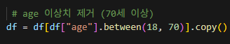 <br>
  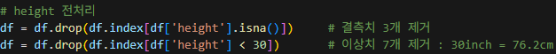 <br>
  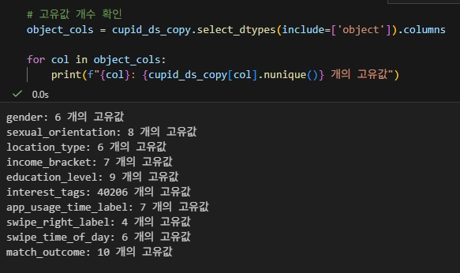
  
</div>


### 전처리

### 1. 인적 사항 및 배경 (Demographic & Background)
| 피처명 | 설명 | 비고 |
| :--- | :--- | :--- |
| **age** | 나이 | 나이대 별 |
| **status** | 연애 중 | 연애를 하는 중, 안하는 중 |
| **orientation** | 성적지향 | 이성애자, 성소수자 |
| **body_type** | 체형 | 마름, 보통, 건강, 통통 |
| **education** | 학력 | 석사이상(4), 학사졸업(3), 학사재학(2), 고등이하(1), 그외(0) |
| **religion** | 종교 | 종교가 있다(1), 없다(0) |
| **job** | 직업 | 연봉 기준으로 0~3로 분류 |

---

### 2. 생활 습관 및 성향 (Lifestyle & Preferences)
- **diet (식단)** : 유연함(0), 중간(1), 엄격함(5)
- **drinks (음주 빈도)** : 안마신다(0), 적당히 마신다(1), 많이마신다(5)
- **drugs (약물 사용)** : 안한다(0), 가끔한다(1), 자주한다(5)
- **smokes (흡연 여부)** : 흡연을 안한다(0), 조금한다(1), 자주 한다(5)
- **niche_score (매칭 시장 내 배타성 지수)** : smokes + drinks + drugs + diet 매칭 마찰력 누적
  > **정의:** 탐색이론기반으로 유저의 생활 습관 데이터에 가중치를 부여하여 매칭 난이도를 수치화 한 지표 <br>
  > **Note:** 음주 기준 0과 1의 지표는 성향 차이라 판단 하지만 5의 지표는 성향 차이가 아닐 것이라 판단해 각각의 1의 합산인 4보다 높게 설정

---

### 3. 활동성 및 서비스 이용 (Engagement & Activity)
- **last_online (마지막 접속)** : 시간별 데이터를 일별 데이터 분류 -> 이탈율 계산
- **response rate (답변성실도)** : 전체의 빈칸이 적은 정도
- **total_essay_len (에세이 총 글자)** : 에세이의 총 글자 수 합산
- **essay_answered_count (작성한 에세이 질문 개수)** : 작성한 essay 질문 개수

---

###  Target Variable (예측 목표)
- **churn (이탈)** : 이탈(1), 잔류(0)
  >**Note:** 앱을 마지막으로 사용한지 14일이 넘을시 이탈자라고 판단 

### EDA


이탈 vs 잔류인원
<div>
  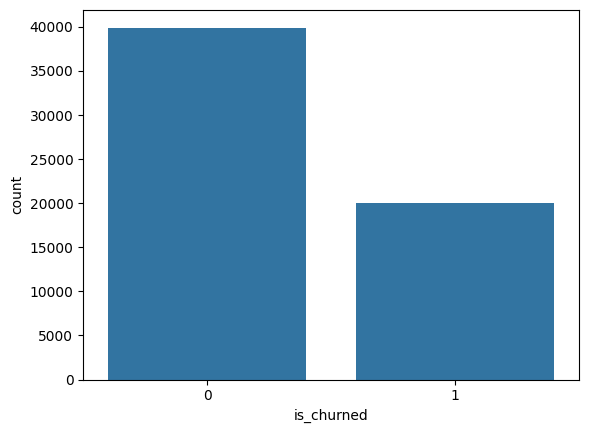
</div>


essay_answered_count별 이탈률
<div>
  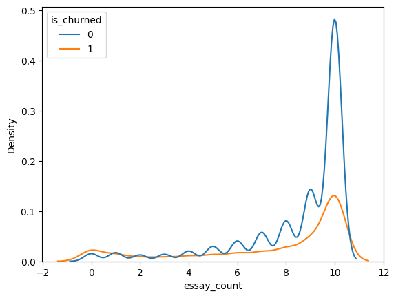
</div>


heatmap
<div>
  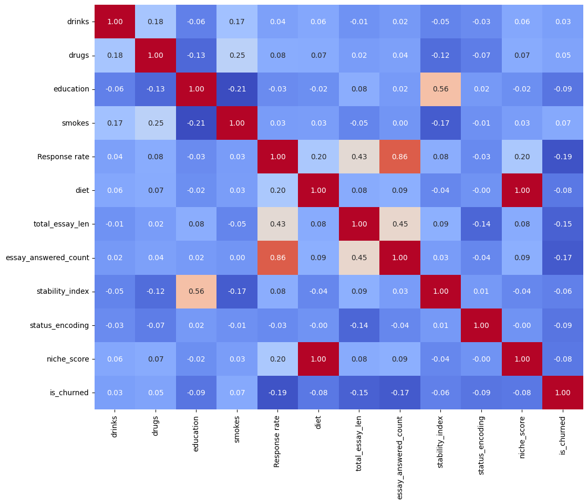
</div>


### 최종 데이터 구조
| 컬럼명                  | 설명                         | 데이터타입 |
|------------------------|-----------------------------|------------|
| sex                    | 성별                        | int8       |
| orientation            | 성적지향 여부                 | int8       |
| diet                   | 식단                         | int64      |
| drugs                  | 약물 사용 여부                | int64      |
| education              | 학력 수준                    | float64    |
| height                 | 키 (inch)                   | float64    |
| body_type_average      | 평균 체형 여부                | bool       |
| body_type_curvy        | 통통한 체형 여부              | bool       |
| body_type_fit          | 건강 체형 여부                | bool       |
| body_type_slim         | 마른 체형 여부                | bool       |
| smokes                 | 흡연자 여부                   | bool      |
| drinks                 | 과음 여부(0, 1 ,5)           | int64      |
| job_score              | 연봉기준  0~3                | float64    |
| religion_religion      | 종교 여부                    | bool       |
| status_encoding        | 연애 상태 인코딩값            | int64      |
| age_group              | 연령대 그룹                  | int64      |
| response rate          | 답변 성실도                  | float64    |
| total_essay_len        | 에세이 전체 글자 수 합산       | int64      |
| essay_answered_count   | 작성한 에세이 질문 개수        | int64      |
| niche_score            | 매칭 시장 내 배타성지수        | float64    |
| churn                  | 고객 이탈                    | int64      |


## 6. 인공지능 학습 결과서

### 모델 성능 평가 비교

<div>
  
</div>

#### 보정전

| 모델명        | Accuracy | Recall | F1-Score |
|--------------|----------|--------|----------|
| Logistic     | 0.59     | 0.49   | 0.45     |
| RandomForest | 0.57     | 0.37   | 0.41     |
| XGBoost      | 0.67     | 0.41   | 0.45     |
| Light GBM    | 0.65     | 0.58   | 0.52     |
| CatBoost     | 0.45     | 0.65   | 0.40     |


* **Logistic Regression**
    * **Strategy:** `SMOTE`를 활용한 오버샘플링 (데이터 불균형 해소)
* **RandomForest**
    * **Optimization:** `Optuna` 기반 베이지안 최적화
    * **Strategy:** `GridSearch`, `CrossValidation`을 통한 전수 조사 및 교차 검증
* **CatBoost**
    * **Strategy:** `RandomSearch`를 활용한 효율적 파라미터 탐색

* **XGBoost & LightGBM**
    * **Optimization:** `Optuna` 기반 베이지안 최적화
    * **Validation:** `K-Fold` 교차 검증
    * **Training Control:** `Early Stopping` 적용 (과적합 방지)
    * **Evaluation & Post-processing:** * `PR_AUC` (정밀도-재현율 곡선 아래 면적) 기준 최적화
        * `Threshold` (임계값) 조정을 통한 최종 모델 보정

<div>
  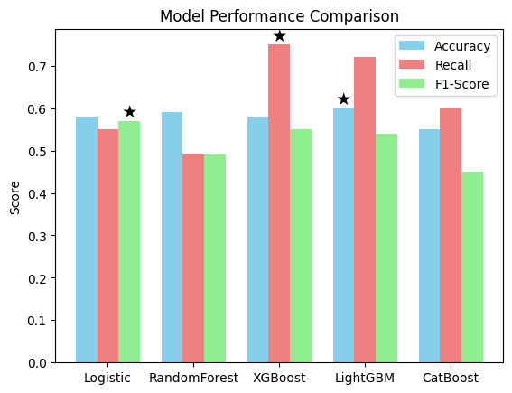
</div>

#### 보정후

| 모델명        | Accuracy | Recall | F1-Score |
|--------------|----------|--------|----------|
| Logistic     | 0.58     | 0.55   | 0.57     |
| RandomForest | 0.60     | 0.48   | 0.48     |
| XGBoost      | 0.58     | 0.75   | 0.55     |
| Light GBM    | 0.60     | 0.72   | 0.54     |
| CatBoost     | 0.55     | 0.70   | 0.45     |

**Accuracy(정확도)**와, **F1-Score**가 고루 분포되어있는가운데 
**Recall(재현율)** 값이 가장 높은 **XGBoost** 채택

### XGBoost 

#### 혼동행렬

<div>
  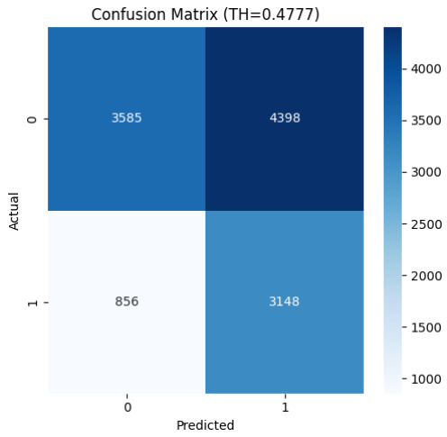
</div>

#### ROC & P-R

<div>
  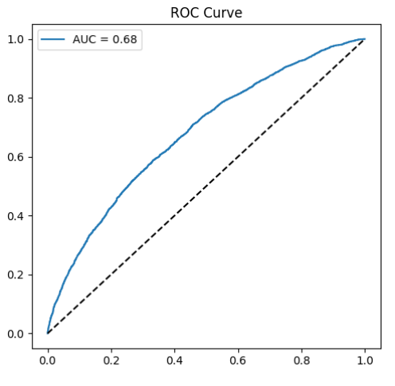
</div>

<div>
  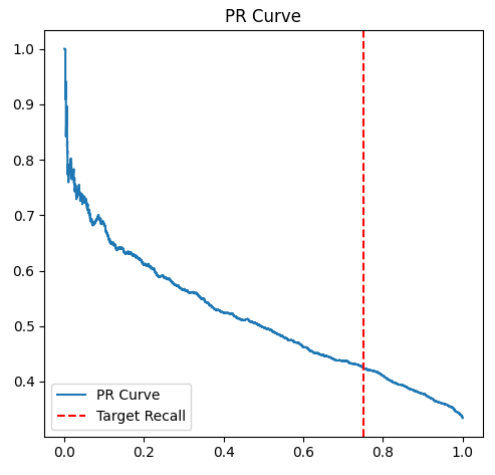
</div>

## 7. 결론

실제 데이팅 앱 비즈니스 환경의 클래스 불균형 문제를 반영하여 **'이탈 잠재 고객을 최대한 놓치지 않는 것'**에 초점을 맞췄습니다. 이를 위해 **Recall(재현율) 최대화**를 핵심 지표로 설정하고 최적화를 진행한 결과, Recall **0.75**를 기록하며 우수한 탐지력을 보여준 **XGBoost**를 최종 모델로 선정하였습니다.

### 테스트 데이터 넣어서 결과 도출

<div>
  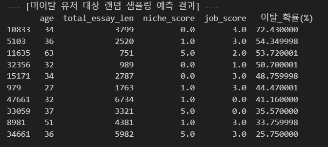
</div>

<div>
 

</div>
### 🔍 한계점

* **미이탈 유저 분석 중 특이 사례 확인**
    * 적절한 연령대와 안정적인 직업군을 보유한 우수 유저임에도 불구하고, 이탈 확률이 최상위권으로 나타나는 역설적인 데이터 존재.
* **'좋은 이탈'의 미구분**
    * 서비스 목적(매칭 성공 등)을 달성하여 떠나는 **'좋은 이탈'**이 일반 이탈과 혼재되어 있음.
    * 현재 학습 데이터 내에서 이 두 유형이 구분되지 않아 모델의 전체적인 **변별력 저하** 발생.

---

### 개선방안

* **비지도 학습 기반의 이탈 동기 군집화**
    * 향후 비지도 학습을 도입하여 단순히 이탈 여부(0, 1)만 맞추는 것을 넘어, **이탈의 성격(동기)에 따른 군집 분석** 수행.
* **분석의 다각화 및 범용성 확보**
    * 이탈 패턴의 정교한 해석을 통해 데이팅 앱뿐만 아니라 채용, 교육 등 **목적 달성형 구독 서비스** 전반에 적용 가능한 예측 프레임워크 구축 가능.
    * 서비스 유형에 따른 복합적인 이탈 패턴을 분석하는 **범용적 모델**로의 확장성 기대.

## 8. 한 줄 회고

<table>
  <colgroup>
    <col style="width: 10%; text-align: center;">
    <col style="width: 85%;">
  </colgroup>
  <thead>
    <tr>
      <th style="text-align: center;">이름</th>
      <th style="text-align: center;">회고</th>
    </tr>
  </thead>
  <tbody>
    <tr>
      <td style="text-align: center;"><strong>고아라</strong></td>
      <td>
  <strong>[Keep]</strong> 깃허브와 README 초기세팅 및 틀, 파이프라인 구성 등 문서화 작업에서 팀에 기여할 수 있었다.<br>
  <strong>[Problem]</strong> ML/DL 모델의 전체적인 흐름과 구조에 대한 학습이 더 필요하다고 느꼈다.<br>
  <strong>[Try]</strong> SMOTE 적용 후 XGBoost/LightGBM의 Recall이 0에 가까워지는 문제를 직접 발견하고 원인을 분석해 해결하면서, 데이터와 모델의 특성을 함께 이해해야 한다는 것을 배웠다. ML과 DL의 전반적인 파이프라인과 코드활용에 대한 좀 더 깊은 이해와 학습이 필요할 것 같다. 
</td>
    </tr>
    <tr>
      <td style="text-align: center;"><strong>권민제</strong></td>
      <td>이번 프로젝트를 통해 모델의 성능 향상을 위한 노력을 기울인 결과, 하이퍼 파라미터 튜닝만큼이나 목적에 부합하는 데이터 전처리가 모델의 예측력에 결정적인 영향을 미친다는 점을 깊이 체감했습니다.  <br>이러한 성찰을 바탕으로 향후에는 비지도 학습을 활용하여 유저의 이탈 동기를 정교하게 라벨링하고 세분화함으로써, 현재의 이진 분류 모델이 가진 한계를 극복하고 모델의 변별력을 한층 더 고도화하는 시도를 이어가고자 합니다.</td>
    </tr>
    <tr>
      <td style="text-align: center;"><strong>김규호</strong></td>
      <td>keep: 데이터의 전처리 과정의 모든 사람의 의견을 듣고 모두가 납득할 방법으로 전처리 시행, 모든 과정에 대해 궁금증을 가지고 접근 <br>
      problem: 행동 데이터의 전처리 과정에 대해 의견 취합<br>
      try: 의견 충돌이 났을 때 두 전처리 데이터를 모두 사용 해보기</td>
    </tr>
    <tr>
      <td style="text-align: center;"><strong>김정현</strong></td>
      <td>이번 프로젝트 진행을 위해 살펴본 해당 데이터셋은 대부분 문자열 값을 갖는 컬럼들이었습니다. 시간이 오래 걸릴 것으로 예상되어 팀원들과 하나씩 의견을 나누며 EDA/전처리 과정을 수행했습니다. <br>다만 컬럼 하나하나마다 범주화를 어떻게 할지 정하는 게 쉽지 않아 전처리 작업이 어려웠고, 기대만큼 모델들의 성능이 나오지 않아 걱정이 컸습니다. 전처리에 대해서는, 처음부터 복잡한 전처리에 매달리기보다 아주 단순한 모델을 먼저 만들고 단계적으로 전처리를 고도화하는 방식을 고려해 보겠습니다. 또한, 성능 향상에 도움이 되는 방법들을 적용해 보고 성능 변화를 살펴보도록 하겠습니다.</td>
    </tr>
    <tr>
      <td style="text-align: center;"><strong>최현진</strong></td>
      <td>이번 프로젝트를 통해 실제 사용자 데이터를 기반으로 이탈률을 예측해볼 수 있어 의미 있었습니다. 하이퍼파라미터와 threshold를 조정하며 성능 개선을 시도했지만, 데이터와 모델의 한계로 기대만큼의 향상은 이루지 못했습니다. 이를 통해 모델 튜닝뿐 아니라 데이터 전처리와 변수 설계가 성능에 큰 영향을 준다는 점을 배울 수 있었습니다.</td>
    </tr>
  </tbody>
</table>

---

## 📁 프로젝트 폴더 구조
---
```

📁 SKN24-2ND-2Team/
├── 📁 data/
|   ├──📁 img/               ← README의 사용된 사진
│   ├── Original data.csv     ← 원본 데이터 CSV (gitignore 처리)
│   └── Original data_process ← 전처리 완료데이터 CSV (gitignore 처리)
│
├── 📁 docs/
│   ├── 기획서.md          ← 프로젝트 기획 문서
│   ├── EDA_결과.md        ← 데이터 분석 정리
│   └── 회의록/            ← 팀 회의 기록
│
├── 📁 models/
│   ├── saved/            ← 학습된 모델 파일 (gitignore 처리)
│   └── results/          ← 모델별 성능 비교 결과 CSV나 이미지
│
├── 📁 notebooks/
│   ├── 01_EDA.ipynb
│   ├── 02_preprocessing.ipynb
│   ├── 03_ML_models.ipynb
│   └── 04_DL_models.ipynb
│
├── 📁 src/
│   ├── preprocess.py     ← 전처리 함수 모듈
│   ├── train.py          ← 학습 실행 스크립트
│   ├── evaluate.py       ← 평가 지표 함수
│   └── predict.py        ← 예측 실행 스크립트
│
├── .gitignore
├── README.md
└── requirements.txt


```
